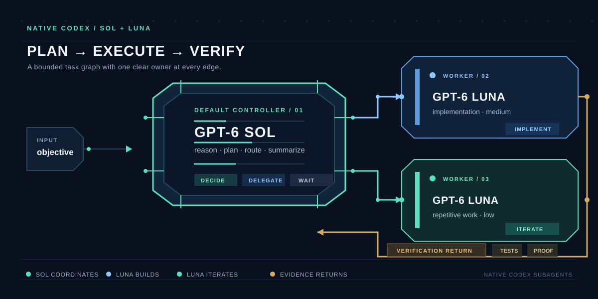

# Codex Orchestrator — Astra + Luna

Adaptación de [Fable orchestrator](https://github.com/codejunkie99/fable-orchestrator)
para usar subagentes nativos de Codex con tus modelos. GPT-6 Astra dirige la
tarea, toma decisiones y revisa el resultado; GPT-5.6 Luna realiza la
implementación y el trabajo repetitivo. No requiere Claude CLI, Fable,
OpenCode Go, un router externo ni claves adicionales de esos proveedores.



## Qué incluye

| Componente | Función |
| --- | --- |
| `skill/codex-orchestrator/SKILL.md` | Flujo de planificación, delegación y verificación |
| `skill/codex-orchestrator/agents/openai.yaml` | Nombre y prompt de la skill en Codex |
| `.codex/config.toml` | Astra principal, Luna por defecto y hasta tres subagentes |
| `.codex/agents/luna-worker.toml` | Implementación con Luna, razonamiento `medium` |
| `.codex/agents/luna-repetitive.toml` | Trabajo mecánico con Luna, razonamiento `low` |
| `.codex/agents/luna-explorer.toml` | Exploración de solo lectura con Luna, razonamiento `low` |
| `install.sh` | Instalación de la skill y los agentes personales |
| `tests/test_skill.sh` | Pruebas locales del instalador |

Los archivos `agents/openai.yaml` de una skill son metadatos de interfaz;
los archivos `.codex/agents/*.toml` definen los subagentes y sus modelos reales.

## Requisitos

Necesitas una versión de Codex que admita subagentes personalizados y acceso
a `gpt-6-astra` y `gpt-5.6-luna` con tu autenticación de Codex. La skill no
concede acceso a modelos ni cambia el modelo de una sesión en curso.
Los modelos y herramientas deben estar disponibles en la sesión real.

El instalador usa Bash y utilidades estándar. Las pruebas usan además `rg`.
No hacen llamadas a modelos ni requieren credenciales.

## Instalación

Desde este repositorio:

```bash
./install.sh --dry-run
./install.sh --copy
```

Se copian la skill a `~/.codex/skills/codex-orchestrator` y los tres agentes
a `~/.codex/agents`. Si `CODEX_HOME` está definido, se usa esa raíz.
El instalador conserva tu `config.toml`: los valores de `.codex/config.toml`
incluidos aquí se aplican a este proyecto cuando Codex carga su configuración
de proyecto de confianza, no automáticamente a todos tus proyectos.

Para otro destino usa `--target /ruta/a/codex`. **Ahora `--target` recibe la
raíz de configuración de Codex, no el directorio `skills` del instalador Fable.**
`--dry-run` no crea archivos. Repetir una instalación idéntica es válido;
si un archivo de destino tiene cambios, el instalador se detiene antes de copiar
para que puedas compararlo y conservar tus personalizaciones.

Abre una nueva tarea después de instalar y selecciona **GPT-6 Astra** como
modelo principal. Los agentes personalizados fijan Luna explícitamente, también
cuando trabajas en otros proyectos. Si quieres los mismos valores por defecto
en otro proyecto, integra las claves de `.codex/config.toml` en su configuración
existente sin reemplazarla completa. La skill limita su flujo a tres subagentes;
el límite de configuración también restringe la concurrencia en este proyecto.

## Uso

```text
$codex-orchestrator implementa esta funcionalidad con tests
```

Astra define tareas acotadas, asigna archivos y criterios de aceptación, y
delega a Luna. Puede ejecutar tareas independientes en paralelo. Después revisa
los cambios y verifica el resultado integrado. Las tareas repetitivas tienen un
límite de iteraciones y los bloqueos regresan al coordinador.

Si los roles personalizados no aparecen, la skill puede usar una selección
explícita de Luna cuando la herramienta nativa lo admita. Si tampoco existe esa
opción, informa del bloqueo. Nunca supone que una etiqueta de modelo garantiza
que el modelo esté disponible, ni deja que un worker herede Astra por accidente.

El ahorro depende del tamaño de las tareas y de cuánto se delegue: más agentes,
contexto duplicado y reintentos pueden aumentar el consumo total. La revisión
y coordinación de Astra siguen consumiendo sus recursos habituales.

## Verificación

```bash
tests/test_skill.sh
```

Las pruebas verifican el comportamiento del instalador en destinos temporales:
simulación sin escrituras, copia fiel, repetición, conflictos y conservación de
archivos ajenos. No prueban el descubrimiento de roles en la app ni el flujo
completo con modelos. Para verificarlo, abre una nueva tarea con Astra e invoca
la skill con una tarea pequeña; comprueba que el subagente ejecutado usa Luna.

## Origen y documentación

La versión original se conserva en el historial Git (commit `e6345e5`). Esta
variante reemplaza la skill `fable` y el helper `ask_fable.sh`; no ejecuta ni
instala el flujo anterior. El instalador tampoco elimina instalaciones previas
de Fable que puedas tener fuera del repositorio.

Configuración basada en la [documentación oficial de subagentes de Codex](https://developers.openai.com/es-419/docs/agent-configuration/subagents).

Licencia MIT; se conserva [LICENSE](LICENSE) del proyecto original.
