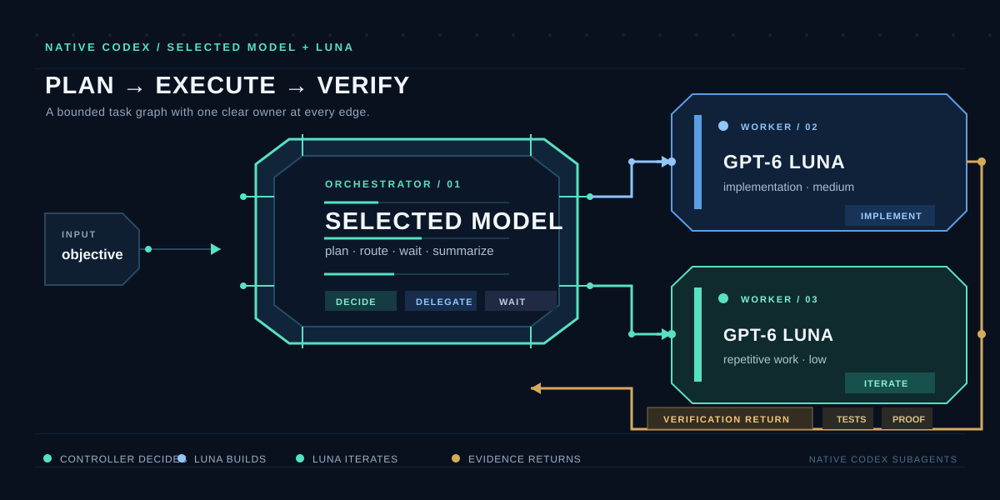

# Codex Orchestrator — selected controller + Luna

Adaptación de [Fable orchestrator](https://github.com/codejunkie99/fable-orchestrator)
para usar subagentes nativos de Codex con tus modelos. El modelo principal que
seleccionaste dirige la tarea si el runtime ofrece delegación; GPT-6 Luna realiza la
implementación, verificación y el trabajo repetitivo. No requiere Claude CLI, Fable,
OpenCode Go, un router externo ni claves adicionales de esos proveedores.



## Qué incluye

| Componente | Función |
| --- | --- |
| `skill/codex-orchestrator/SKILL.md` | Flujo de planificación, delegación y verificación |
| `skill/codex-orchestrator/agents/openai.yaml` | Nombre y prompt de la skill en Codex |
| `.codex/config.toml` | Sol por defecto, Luna por defecto y hasta cuatro subagentes |
| `.codex/agents/luna-worker.toml` | Implementación con Luna, razonamiento `medium` |
| `.codex/agents/luna-repetitive.toml` | Trabajo mecánico con Luna, razonamiento `low` |
| `.codex/agents/luna-explorer.toml` | Exploración de solo lectura con Luna, razonamiento `low` |
| `.codex/agents/luna-deep-worker.toml` | Debugging e integración difícil con Luna, razonamiento `xhigh` |
| `.codex/agents/luna-verifier.toml` | Verificación enfocada con Luna, razonamiento `high` |
| `.codex/agents/luna-infra.toml` | Docker, infraestructura y CI/CD con Luna |
| `.codex/agents/luna-backend.toml` | APIs, servicios y lógica de negocio con Luna |
| `.codex/agents/luna-frontend.toml` | UI, estado cliente y accesibilidad con Luna |
| `.codex/agents/luna-database.toml` | Esquema, migraciones e integridad de datos con Luna |
| `.codex/agents/luna-qa.toml` | Estrategia de pruebas y regresiones con Luna |
| `.codex/agents/luna-security.toml` | Threat modeling y revisión de seguridad read-only |
| `.codex/agents/luna-docs.toml` | README, contratos y documentación técnica con Luna |
| `install.sh` | Instalación de la skill y los agentes personales |
| `tests/test_skill.sh` | Pruebas locales del instalador |

Los archivos `agents/openai.yaml` de una skill son metadatos de interfaz;
los archivos `.codex/agents/*.toml` definen los subagentes y sus modelos reales.

## Requisitos

Necesitas una versión de Codex que admita subagentes personalizados y acceso
a `gpt-6-luna` con tu autenticación de Codex. La skill no
concede acceso a modelos ni cambia el modelo de una sesión en curso.
Los modelos y herramientas deben estar disponibles en la sesión real.

El instalador usa Bash y utilidades estándar. Las pruebas usan además `rg`.
No hacen llamadas a modelos ni requieren credenciales.

## Instalación

Desde este repositorio:

```bash
./install.sh --dry-run
./install.sh --copy
# To update an existing installation from this repository:
./install.sh --copy --update
```

Se copian la skill a `~/.codex/skills/codex-orchestrator` y los doce agentes
a `~/.codex/agents`. Si `CODEX_HOME` está definido, se usa esa raíz.
El instalador conserva tu `config.toml`: los valores de `.codex/config.toml`
incluidos aquí se aplican a este proyecto cuando Codex carga su configuración
de proyecto de confianza, no automáticamente a todos tus proyectos.

Para otro destino usa `--target /ruta/a/codex`. **Ahora `--target` recibe la
raíz de configuración de Codex, no el directorio `skills` del instalador Fable.**
`--dry-run` no crea archivos. Repetir una instalación idéntica es válido;
si un archivo de destino tiene cambios, el instalador se detiene antes de copiar
para que puedas compararlo y conservar tus personalizaciones. Usa `--update`
cuando quieras reemplazar los archivos administrados por esta versión; los
archivos ajenos, incluido `config.toml`, no se modifican.

Abre una nueva tarea después de instalar. El modelo principal seleccionado por
ti dirige como controlador cuando el runtime proporciona delegación. El proyecto
conserva GPT-6 Sol como modelo predeterminado; GPT-6 Astra y GPT-6.1 Sol son
ejemplos de otros modelos que pueden seleccionarse, sin garantizar que todos los
modelos dispongan de herramientas de delegación. Si no están disponibles, la
skill informa el bloqueo sin cambiar el modelo ni ejecutar el trabajo desde el
controlador. El controlador
queda en razonamiento `low`: planifica, crea agentes, espera resultados y resume.
No debe leer el workspace, editar archivos, ejecutar comandos ni lanzar tests directamente. Los agentes
personalizados fijan Luna explícitamente, también cuando trabajas en otros
proyectos. Si quieres los mismos valores por defecto en otro proyecto, integra
las claves de `.codex/config.toml` en su configuración existente sin reemplazarla
completa. La skill limita su flujo a cuatro subagentes activos. Es un máximo,
no un objetivo: los nodos solo se ejecutan en paralelo si sus scopes de escritura
son disjuntos. Cambios que comparten archivos, contratos, migraciones o
configuración raíz se serializan y cada ruta tiene un único owner. Todos los
agentes de ejecución fijan GPT-6 Luna (`gpt-6-luna`).

## Uso

```text
$codex-orchestrator implementa esta funcionalidad con tests
```

El modelo principal seleccionado define tareas acotadas, asigna archivos y criterios de aceptación,
y delega todas las acciones a Luna. `luna_explorer` descubre el código;
`luna_infra`, `luna_backend`, `luna_frontend`, `luna_database`, `luna_qa`,
`luna_security` y `luna_docs` enrutan por dominio; `luna_worker` implementa
cambios sin dominio específico; `luna_repetitive` realiza transformaciones
finitas; `luna_deep_worker` atiende debugging o integración compleja con
`xhigh`; y `luna_verifier` ejecuta verificaciones enfocadas. El controlador no
ejecuta comandos ni edita archivos. Las tareas repetitivas tienen un límite de
iteraciones y los bloqueos regresan al coordinador.

Puedes pedir el esfuerzo explícitamente:

```text
$codex-orchestrator corrige este bug con Luna xhigh
$codex-orchestrator migra estos archivos con Luna low
$codex-orchestrator implementa la arquitectura con Luna max
```

Si los roles personalizados no aparecen, la skill puede usar una selección
explícita de Luna cuando la herramienta nativa lo admita. Si tampoco existe esa
opción, informa del bloqueo. Nunca supone que una etiqueta de modelo garantiza
que el modelo esté disponible, ni deja que un worker herede el modelo del
controlador por accidente.

El ahorro depende del tamaño de las tareas y de cuánto se delegue: más agentes,
contexto duplicado y reintentos pueden aumentar el consumo total. La coordinación
del modelo principal sigue consumiendo recursos, pero el trabajo operativo
se desplaza a Luna. La skill no puede quitar técnicamente todas las herramientas
del hilo principal; el modo controlador estricto es una frontera de instrucciones
que el runtime debe respetar.

## Verificación

```bash
tests/test_skill.sh
```

Las pruebas verifican el comportamiento del instalador en destinos temporales:
simulación sin escrituras, copia fiel, repetición, conflictos y conservación de
archivos ajenos. No prueban el descubrimiento de roles en la app ni el flujo
completo con modelos. Para verificarlo, abre una nueva tarea con un modelo que
disponga de delegación nativa e
invoca la skill con una tarea pequeña; comprueba que el subagente ejecutado usa Luna.

## Origen y documentación

La versión original se conserva en el historial Git (commit `e6345e5`). Esta
variante reemplaza la skill `fable` y el helper `ask_fable.sh`; no ejecuta ni
instala el flujo anterior. El instalador tampoco elimina instalaciones previas
de Fable que puedas tener fuera del repositorio.

Configuración basada en la [documentación oficial de subagentes de Codex](https://developers.openai.com/es-419/docs/agent-configuration/subagents).

Licencia MIT; se conserva [LICENSE](LICENSE) del proyecto original.
